# My Raspberry Pi 4 build

My RPi will be running [openHABian](https://github.com/openhab/openhabian), at least initially. It's going to be my "home automation controller", so I can't have it shut down every time there's a thunderstorm or a power outage. As such, I chose the [PiJuice](https://github.com/PiSupply/PiJuice) [HAT](https://uk.pi-supply.com/products/pijuice-standard) to act as an integrated UPS. I still have to manually disconnect the charger when there's a thunderstorm, but at least everything won't go offline and have to be restarted once the storm has passed.

I tried to find an off-the-shelf solution that I could use, or at least use as a basis for modification. That turned out to be difficult, I found nothing that was close to satisfying. My "solution" had to work with the PiJuice HAT, which made many of the existing cooling kits impossible to use. I ended up buying:

*   A set of glue-on heat sinks.
*   One 40mm PWM fan.
*   Four 20mm standoffs.
*   Two GPIO stacking headers (I bought two of slightly different height, you might need to shorten the pins on one of them slightly if both are of the "long" type).

I found a piece of plastic "plate" that I could cut into shape to hold everything in place. This can be anything really, as long as it has the rigidity to hold the fan in place without vibrating. I used a Dremel with a metal cutting disk for most of the cutting and a battery drill for drilling holes. For doing the "finer shaping" I used some small grinding stones for the Dremel and some hand-held knives.  

  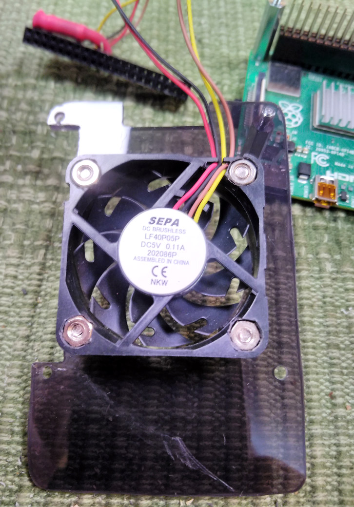
  &nbsp;
  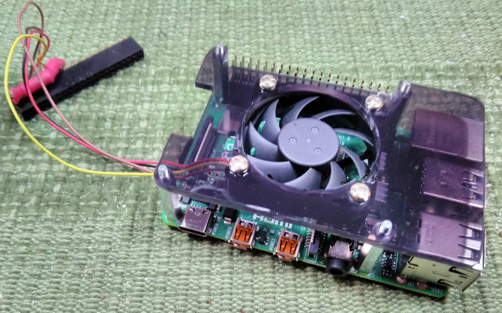
  &nbsp;
  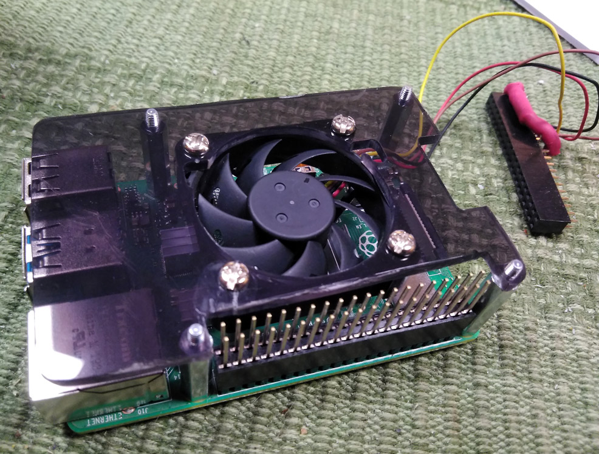

I was initially planning to put the GPIO header on top of the PiJuice board. However, I bought a PiJuise case (with more vertical space than most RPi cases) with the PiJuice, and when I tried to assemble it all, it turned out that the whole assembly got too high to fit in the PiJuice case. Thus, I had to come up with a different solution.

I ended up desoldering the GPIO header from the fan wires and soldering the wires to one of the stacking headers instead, while taking care to make sure it could still be "stacked". To prevent getting soldering tin too high up on the pins, making them too thick and "unstackable", I removed the individual pins that I were to solder a wire to, and then put them back after soldering. The black and red are crimp tubes I used around the RPM pull-up resistor to prevent the possibility of accidental short circuits.

  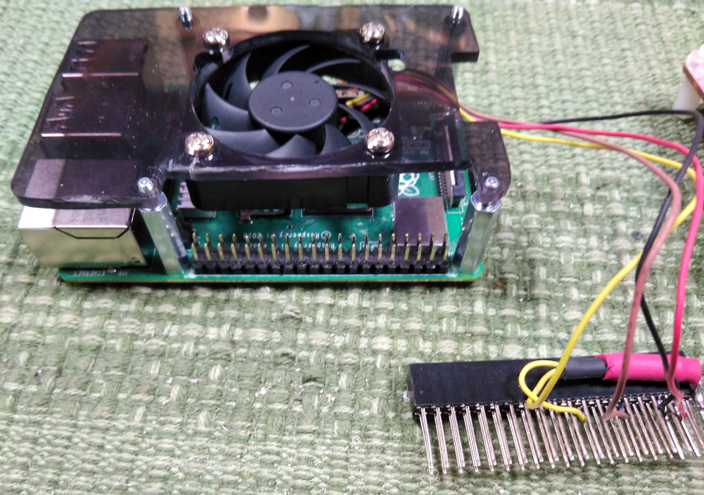
  &nbsp;
  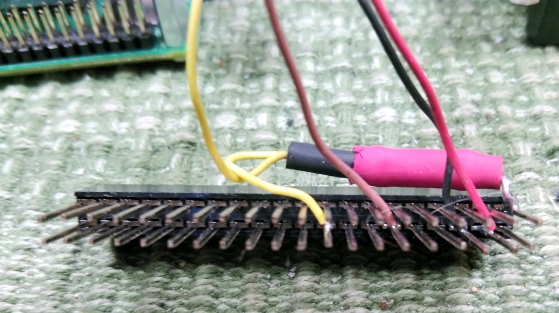

  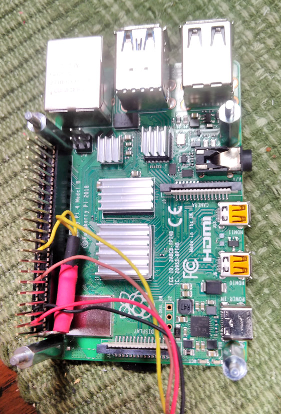
  &nbsp;
  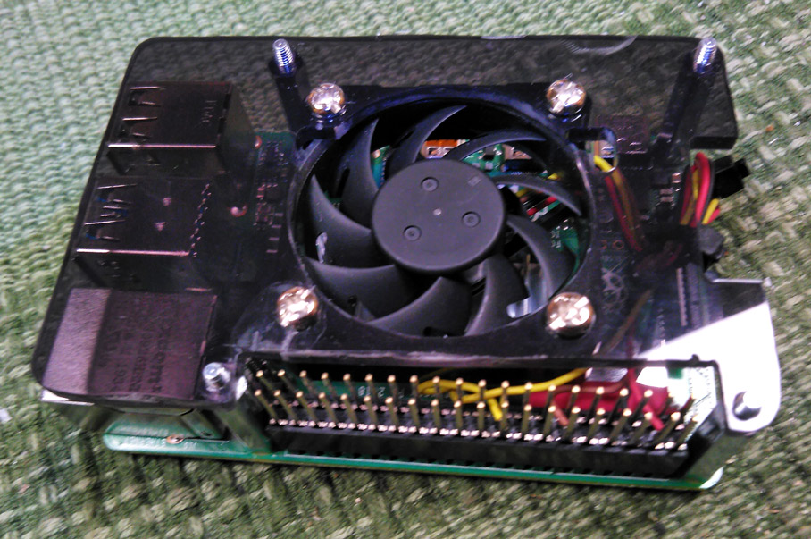

&nbsp;

With that out of the way, it was time to mount the PiJuice on top.

  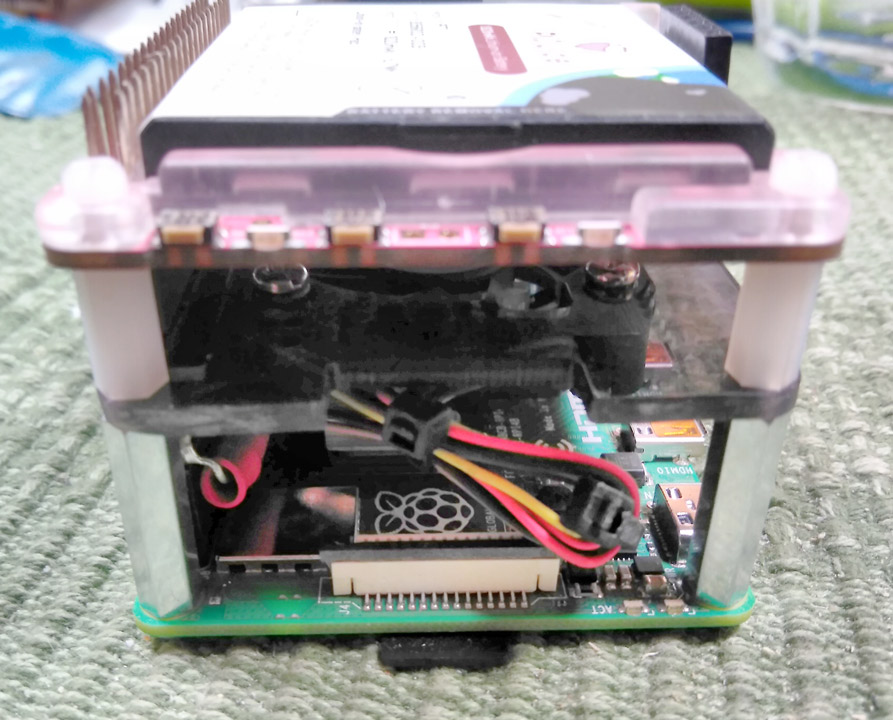
  &nbsp;
  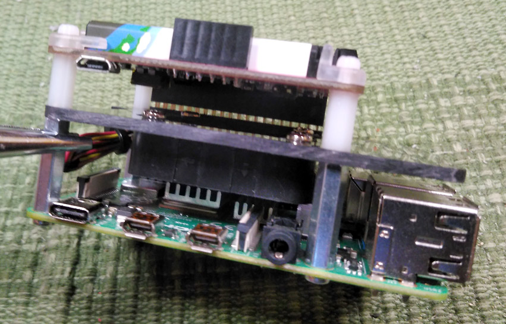

There are three programmable buttons on the PiJuice that can be used for anything you like. Reserving one to be the power button for the RPi is probably a good idea, since it will no longer shut down when you remove the power cable. The buttons need to be serviceable also with the case mounted. The "original solution" for the PiJuice case consists of three small holes where you can insert something tiny. I'm not too ken on using something of metal for this, potentially short circuiting something if I "miss" the tiny button, which means I will have to keep some small plastic or wooden "pin" close by at all times. This is bound be missing when you need it at some stage, so I opted for another solution.

Since my fan mount has raised the PiJuice, the existing holes won't line up, so I have to drill new ones anyway. I found some plastic "locking pins" from some "flexi rods" (for curling hair) and heavily modified them using an electric drill, some files and knives. As this was all done by hand, they don't look pretty, but they do the job. Once that was taken care of, it was time to put the assembly inside the case.

  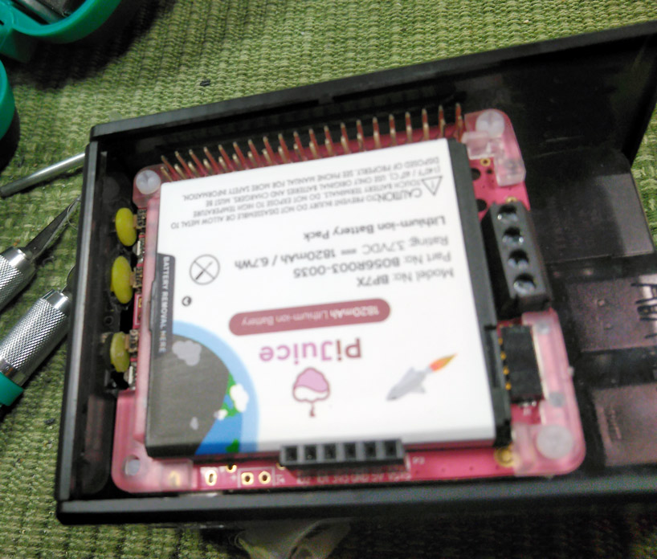
  &nbsp;
  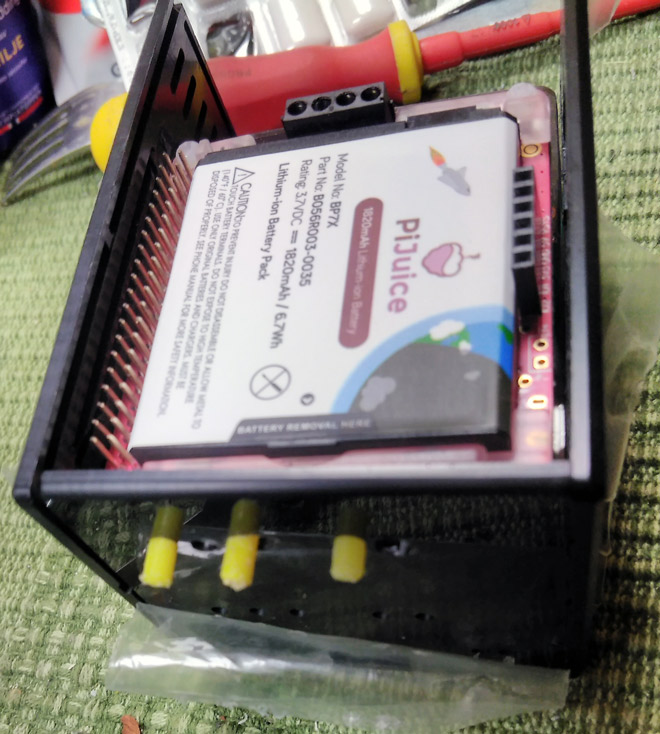
  &nbsp;
  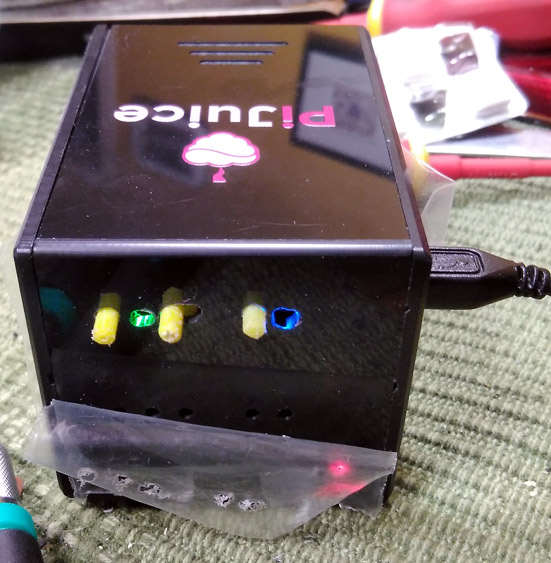

After putting it all together, I thought the case was a little light on vents, so I drilled some more holes for easier air exchange inside the case.

  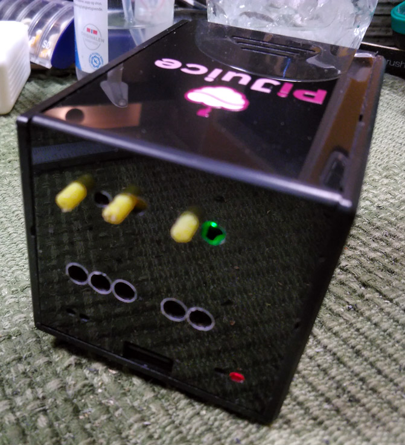
  &nbsp;
  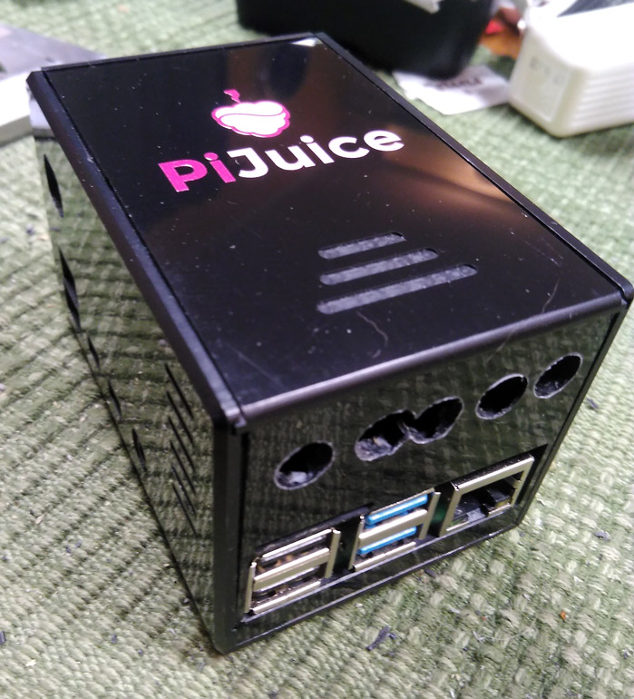

All in all I think it turned out functional and well, while not exactly pretty. If it were meant to be on display, I would have put some more work into precision while modifying the case, but the case isn't exactly a looker to begin with in my opinion. One thing that caused me some frustration, and made the end result look worse than it would otherwise have, is the fact that there's quite a few "milled tracks" on the inside of the case, and these "tracks" would catch the drill bit and steer it in directions that I didn't intend or approve of. If I am ever to repeat this, I'm going to take the trouble to do the drilling in the drill press while fixing the case in place so it can't move, instead of doing this "by hand".

There are two programmable LEDs on the PiJuice. One of them is used to show the battery level and charge status by default. I've made the `pifan-pijuice` service utilize the second LED to indicate the fan speed by changing its color.
