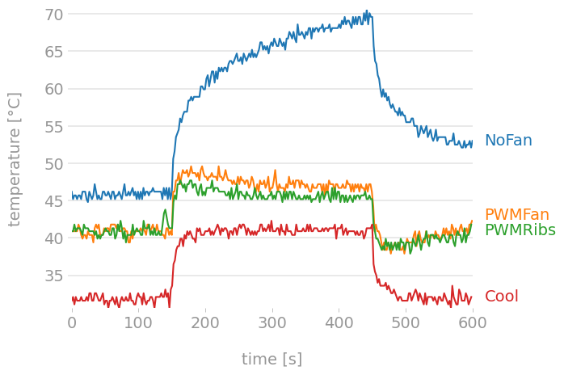

# Raspberry Pi hardware PWM CPU fan control

This is a few Python scripts that can be used to control a PWM (Pulse-Width Modulation) fan on the Raspberry Pi using one of the hardware PWM channels and the onboard temperature sensor. PWM fans allow for more precise RPM control than those using voltage control. PWM is also easier to utilize from the Raspberry Pi since the ability to generate a PWM signal is already there, while a voltage regulator is not.

PiFan is based on [DriftKingTW/Raspberry-Pi-PWM-Fan-Control](https://github.com/DriftKingTW/Raspberry-Pi-PWM-Fan-Control), but has been rewritten to use hardware PWM instead of software PWM. This allows much higher PWM frequencies and offloads the CPU so that it won't have to keep generating the PWM pulses. To get an overview over the GPIO pins, consult [pinout.xyz](https://pinout.xyz/#).

The wiring is identical to the original project, and a great guide can be found [here](http://web.archive.org/web/20220612050958/https://blog.driftking.tw/en/2019/11/Using-Raspberry-Pi-to-Control-a-PWM-Fan-and-Monitor-its-Speed/). I've also made a little writeup on [how I built my fan solution and put it all together in a case](MY_BUILD.md).

## Behavior

Why use a temperature control that gradually increases the fan RPM as the temperature rises, as opposed to the "original" Raspberry Pi fan that simply turns on and off at a set temperature? Is it all worth it? Dynamic fan speed control allows much tighter control of temperature fluctuations, which will increase the life of the CPU and other components. In addition it is virtually silent and consumes less power, unless you configure it to enforce very low temperatures.

Below is a comparison of different setups I've tested while running [stressberry](https://github.com/nschloe/stressberry). You can read about how I used it [here](STRESSBERRY.md).

<figure>
  
  <figcaption><sup>Stressberry results run on a stock clocked (0.6-1.5 GHz) Raspberry Pi 4 4Gb without a case using the "ondemand" governor. NoFan is the reference, there is no cooling at all. PWMFan is using PiFan (off=38°C min=42°C max=60°C) with a 40mm PWM fan. PWMRibs is using PiFan (off=38°C min=42°C max=60°C) with a 40mm PWM fan and with heat sinks. Cool is using PiFan (off=28°C min=30°C max=40°C) with a 40mm PWM fan with heat sinks. With the "Cool" setting the fan is clearly audible.</sup></figcaption>
</figure>

## Prerequisites

If you install one of the `.deb` packages, the dependencies will be installed automatically. If you're not using a Debian based system, Python and Pip must be installed first. When that's done, install the Python dependencies with:

```bash
pip3 install 'rpi-hardware-pwm>=0.1.4'
```

### Enabling hardware PWM

Hardware PWM isn't enabled by default on Raspberry Pi OS and derivatives. Enabling it requires editing `/boot/config.txt` and adding an overlay. Changes aren't effectuated until the next boot, but can be configured on the prepared image before the installation starts. The Raspberry Pi kernel documentation allows either single or dual channel hardware PWM.

| PWM | GPIO | Function | Alt | Exposed |
|:---:|:---:|:---:|:---:|:---:|
| PWM0 | 12 | 4 | Alt0 | Yes |
| PWM0 | 18 | 2 | Alt5 | Yes |
| PWM0 | 40 | 4 | Alt0 | No |
| PWM0 | 52 | 5 | Alt1 | No |
| PWM1 | 13 | 4 | Alt0 | Yes |
| PWM1 | 19 | 2 | Alt5 | Yes |
| PWM1 | 41 | 4 | Alt0 | No |
| PWM1 | 45 | 4 | Alt0 | No |
| PWM1 | 53 | 5 | Alt1 | No |

Which pins are accessible varies by model, but on most Raspberry Pis only GPIO 12, 18, 13 and 19 are exposed and available for use. If you have followed the wiring guide referenced above, GPIO 18 is used for the PWM signal, but any of these can be used. The `/boot/config.txt` overlay creates a "mapping" between the "PWM channels" and the PWM capable GPIO pins, as can be seen in the table above. The "official documentation" can be found in [`/boot/overlays/README`](https://github.com/raspberrypi/linux/blob/45599fd8fe420ede67b0a28767a335d1d203f9cf/arch/arm/boot/dts/overlays/README#L2898-L2935).

#### Example configuration for a single PWM channel

The `pwm` overlay is used for a single channel. There are 4 options for the normally exposed GPIO pins (2 for channel 0 and 2 for channel 1). The resulting "code" to enter in `/boot/config.txt` is shown in the `dtoverlay` column.

| PWM | GPIO | Function | Alt | dtoverlay |
|:---:|:---:|:---:|:---:|:---:|
| PWM0 | 12 | 4 | Alt0 | dtoverlay=pwm,pin=12,func=4 |
| PWM0 | 18 | 2 | Alt5 | dtoverlay=pwm,pin=18,func=2 |
| PWM1 | 13 | 4 | Alt0 | dtoverlay=pwm,pin=13,func=4 |
| PWM1 | 19 | 2 | Alt5 | dtoverlay=pwm,pin=19,func=2 |

Edit `/boot/config.txt` and add the "dtoverlay line" from the table above. If you wired according to the wiring guide, you need to use `dtoverlay=pwm,pin=18,func=2`. Root privileges are required for this:

```bash
sudo nano /boot/config.txt
```

After making the changes, save the file with `Ctrl + s`, close Nano with `Ctrl + x`, and reboot:

```bash
sudo reboot
```

#### Example configuration for dual PWM channels

The `pwm-2chan` overlay is used for dual channels. There are 4 options for the normally exposed GPIO pins. The resulting "code" to enter in `/boot/config.txt` is shown in the `dtoverlay` column.

| PWM0 GPIO | PWM0 Function | PWM0 Alt | PWM1 GPIO | PWM1 Function | PWM1 Alt | dtoverlay |
|:---:|:---:|:---:|:---:|:---:|:---:| --- |
| 12 | 4 | Alt0 | 13 | 4 | Alt0 | dtoverlay=pwm-2chan,pin=12,func=4,pin2=13,func2=4 |
| 18 | 2 | Alt5 | 13 | 4 | Alt0 | dtoverlay=pwm-2chan,pin=18,func=2,pin2=13,func2=4 |
| 12 | 4 | Alt0 | 19 | 2 | Alt5 | dtoverlay=pwm-2chan,pin=12,func=4,pin2=19,func2=2 |
| 18 | 2 | Alt5 | 19 | 2 | Alt5 | dtoverlay=pwm-2chan,pin=18,func=2,pin2=19,func2=2 |

Edit `/boot/config.txt` and add the "dtoverlay line" from the table above. Root privileges are required for this:

```bash
sudo nano /boot/config.txt
```

After making the changes, save the file with `Ctrl + s`, close Nano with `Ctrl + x`, and reboot:

```bash
sudo reboot
```

#### Verifying that the overlay is working

After rebooting, you can check that the overlay is working with:

```bash
lsmod | grep pwm_bcm
```

It should give an output resembling for example `pwm_bcm2835 16384 1` or `pwm_bcm2835 2711 0`.

### Downloading

For those using a Debian based system like Raspberry Pi OS, the files can be downloaded with:
```bash
wget https://github.com/Nadahar/PiFan/releases/download/v1.0.0/pifan_1.0.0_all.deb
wget https://github.com/Nadahar/PiFan/releases/download/v1.0.0/pifan-pijuice_1.0.0_all.deb
wget https://github.com/Nadahar/PiFan/releases/download/v1.0.0/pifan-monitor_1.0.0_all.deb
```
If you don't use a Debian based system, you have to checkout this repository using `git clone https://github.com/Nadahar/PiFan.git` and the place the files you need where you want them manually.

### GPG signature verification

While I think the risk of somebody maliciously modifying these files is small as long as they are downloaded from GitHub, I've added GPG signatures so that the files can be verified before installation if you so desire. To be able to verify a particular file's integrity, you need to download the corresponding `.sig` file first:
```bash
wget https://github.com/Nadahar/PiFan/releases/download/v1.0.0/pifan_1.0.0_all.deb.sig
wget https://github.com/Nadahar/PiFan/releases/download/v1.0.0/pifan-pijuice_1.0.0_all.deb.sig
wget https://github.com/Nadahar/PiFan/releases/download/v1.0.0/pifan-monitor_1.0.0_all.deb.sig
```

Before you can verify the GPG signature, you must download the public key from a keyserver. These have changed quite a lot the last years, so you might have to use another server for this to work in the future. At the time of writing, the Ubuntu server still works. This step does *not* need to be repeated for subsequent verifications of the same signature on the same system:
```bash
gpg --keyserver keyserver.ubuntu.com --recv-keys 0xED0A8DF3AF0054DB16EC678A101C00449760763B
```
Once the key is known to your system, you can verify the file integrity by running:
```bash
gpg --verify <signature file name>
```
Please note that both the `.deb` and the corresponding `.sig` file must be in the same folder for the verification to succeed. Example for verifying `pifan_1.0.0_all.deb`:
```bash
gpg --verify pifan_1.0.0_all.deb.sig
```

## Installation

To make installation easier, PiFan has been split into three `.deb` packages that can be installed using `apt`:

*   `pifan` - contains the service that will regulate the fan speed according to the Raspberry Pi integrated temperature sensor. It will start automatically when the system starts and won't produce any output except for a few lines of logging in the system log.
*   `pifan-pijuice` - does the same as `pifan` but also signals the PiJuice LED to reflect the fan speed.
*   'pifan-monitor' - is a simple script that outputs the fan RPM once a second while running, if a fan speed signal is connected to a GPIO pin. It will only run when started manually by typing `pifan-monitor`. It can be handy to verify that the fan acts as intended.

The package installations will make sure that the necessary dependencies are installed. The `pifan` and `pifan-pijuice` packages are configured to conflict with each other, which means that only one can be installed at a time. Installing one will automatically uninstall the other.

If you're going to use PiFan together with a [PiJuice](https://github.com/PiSupply/PiJuice) [HAT](https://uk.pi-supply.com/products/pijuice-standard), you probably want to use `pifan-pijuice`. If you don't have a PiJuice HAT, or don't want the PiJuice LED to indicate the fan status, you should use `pifan`.

All packages can be installed using `apt`, but since they don't exist in any repository, the file name must be specified instead of the package name when running `apt install`:
```bash
sudo apt install ./<package name>.deb
```
If the package is named `pifan_1.0.0_all.deb` and is located in the current folder, the installation command is:
```bash
sudo apt install ./pifan_1.0.0_all.deb
```
Once the installation is complete, you don't need the `.deb` files unless you want to reinstall them in the future. You don't need the file or the filename for uninstallation. To uninstall run:
```bash
sudo apt remove <package name>
```
..where `<package name>` is `pifan`, `pifan-pijuice` or `pifan-monitor`. If the package name is `pifan`, the uninstallation command is:
```bash
sudo apt remove pifan
```

# Configuration

Ideally there should be dedicated configuration files that could be configured and kept independent of version upgrades or package removal. I haven't take the trouble to make that (yet), since I don't really know is anybody else is going to use this. So, for now, the configuration is done by editing the scripts themselves. This is almost acceptable since these packages don't exist in any package repository, and won't be upgraded (and overwritten) automatically. Uninstalling a package *will* delete any configuration customization though.

The script files can be found in `/usr/local/bin` and can be edited with any text editor like `nano`, `vim` etc. Remember to do a service restart after modifying the values for them to take effect:
```bash
sudo systemctl restart pifand
```

The configuration options for `pifan` and `pifan-pijuice` are:

| Name | Default | Unit | Description |
| :--: | :-----: | :--: | :---------: |
| `DEBUG` | `False` | `boolean` | Set to `True` for debug logging, should normally be `False`. |
| `PWM_FREQ` | `23000` | `Hz` | The PWM frequency (number of pulses per second). |
| `PWM_CHANNEL` | `0` | `integer` | The PWM channel. |
| `WAIT_TIME` | `2` | `second` | The time to wait between each regulation cycle. |
| `OFF_TEMP` | `38` | `°C` | The temperature below which to stop the fan. |
| `MIN_TEMP` | `42` | `°C` | The temperature above which to start the fan. |
| `MAX_TEMP` | `60` | `°C` | The temperature at which to operate at max fan speed. |
| `FAN_OFF` | `0` | `%` | The fan duty to use when the fan is off. |
| `FAN_START` | `35` | `%` | Fan startup duty (some fans require a higher startup than minimum duty to spin up). |
| `FAN_LOW` | `30` | `%` | The lowest fan duty to use (check fan specification). |
| `FAN_HIGH` | `100` | `%` | The highest fan duty to use. |

The configuration options for `pifan-monitor` are:

| Name | Default | Unit | Description |
| :--: | :-----: | :--: | :---------: |
| `TACH` | `24` | `integer` | The fan's tachometer output GPIO pin number. |
| `PULSE` | `2` | `integer` | The number of pulses per revolution, most fans seems to use two. |
| `WAIT_TIME` | `1` | `second` | The time to wait between each refresh. |

# Troubleshooting and contributions

If you have any questions please create an [issue](https://github.com/Nadahar/PiFan/issues). Likewise, if you have any improvements or suggestions, please create a [pull request](https://github.com/Nadahar/PiFan/pulls).
