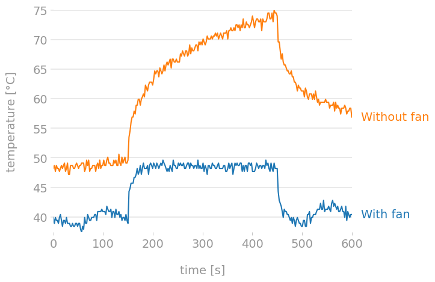

# Measuring cooling performance

It's useful to know how much of a difference, if any, a certain modification does. There are many ways to do that, but I found [nschloe/stressberry](https://github.com/nschloe/stressberry) pretty handy. It lets you run identical stress tests that are easy to compare, and produces nice plots like this:

<figure>
  
  <figcaption><sup>These tests were run with the RPi inside the case and with PiFan either stopped or running. Passive heat sinks were glued to the ICs in both cases. It doesn't leave much doubt about difference having a fan makes.</sup></figcaption>
</figure>

## Installation

First, `stress` must be installed:
```bash
sudo apt install stress
```
..and then `stressberry` itself:
```bash
pip3 install stressberry
```

Depending on what packages are already installed on your system, you might get an error for some missing file when you try to run `stressberry-plot`. On my installation I got:
```
libcblas.so.3: cannot open shared object file: No such file or directory
```
I used the following to figure out which package it belongs to (`apt-file` must be installed):
```bash
sudo apt-file find libcblas.so.3
```
..which revealed that the file belongs to `libatlas3-base`. Thus:
```bash
sudo apt install libatlas3-base
```
..took care of that. The next attempt to plot revealed that 'libopenjp2.so.7' was also missing - which I solved by installing `libopenjp2-7`.

If you want to be able to run stressberry without specifying the path, you must add the installation folder to the `$PATH` yourself. I opted instead to simply prefix the script with the path when running, like this:
```bash
~/.local/bin/stressberry-run
```

## Use

To run the test itself, run:
```bash
~/.local/bin/stressberry-run -n 'With fan' with_fan.dat
```
The `-n` argument is optional, but gives you to opportunity to specify a "title" that will be used for this test when plotted later.

Once the test(s) is/are complete, you can create a plot by running:
```bash
MPLBACKEND=Agg ~/.local/bin/stressberry-plot with_fan.dat -o with_fan.png
```
You can combine as many "input files" as you want before the `-o` argument, and they will be combined in the same plot, for example:
```bash
MPLBACKEND=Agg ~/.local/bin/stressberry-plot with_fan.dat without_fan.dat -o compare.png
```

That's it, the plot can be found in `with_fan.png` or `compare.png` respectively.
